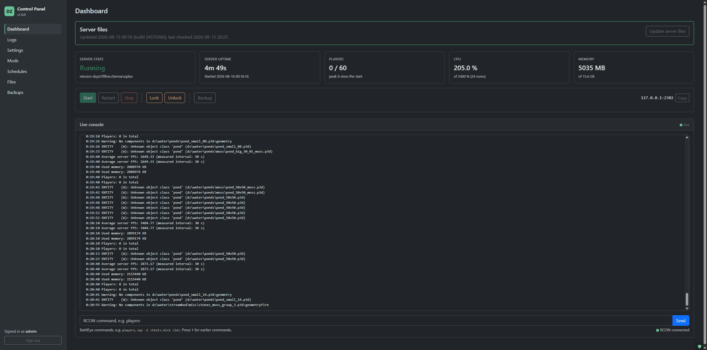
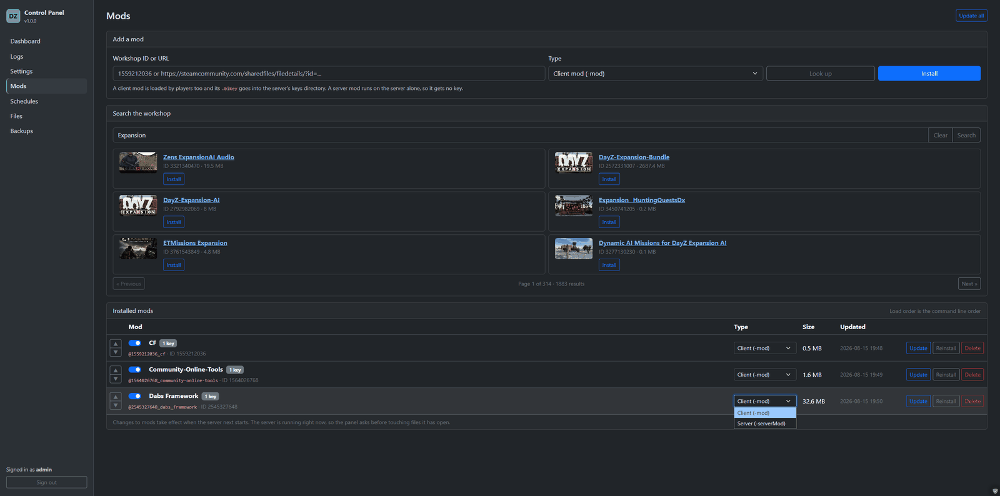
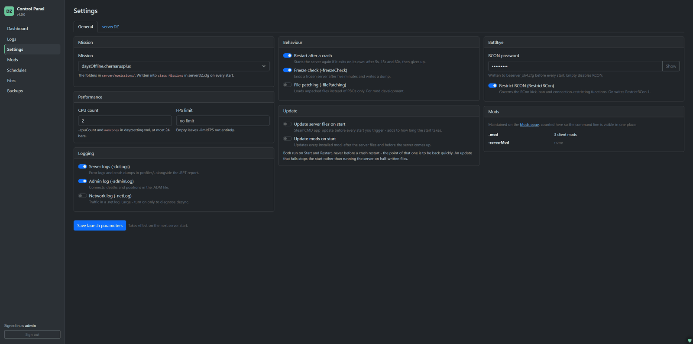
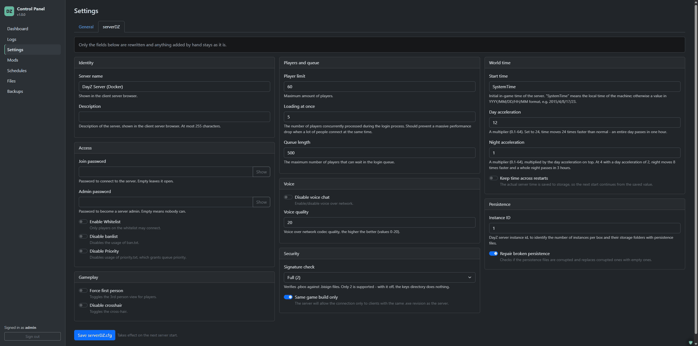
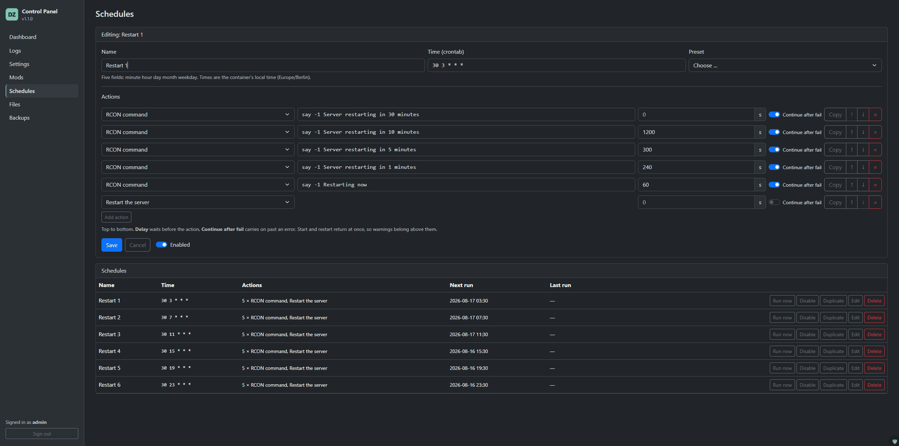
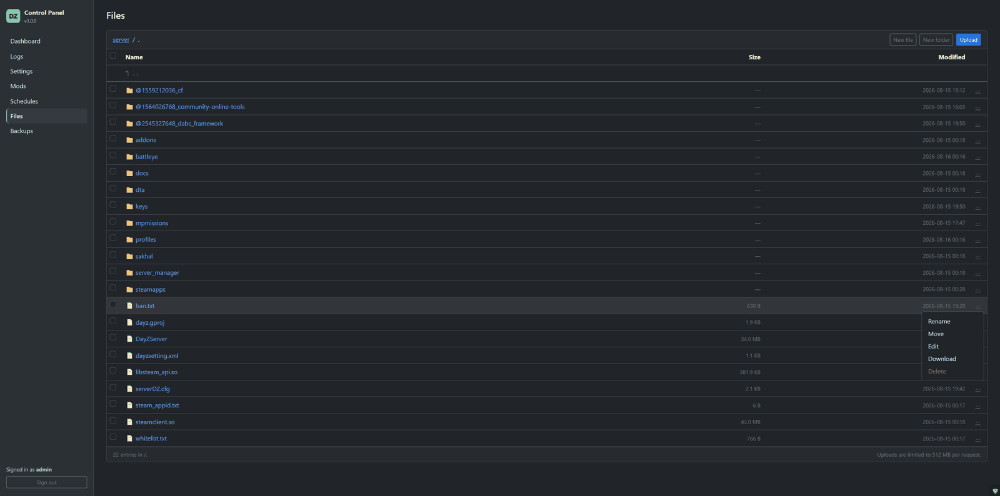
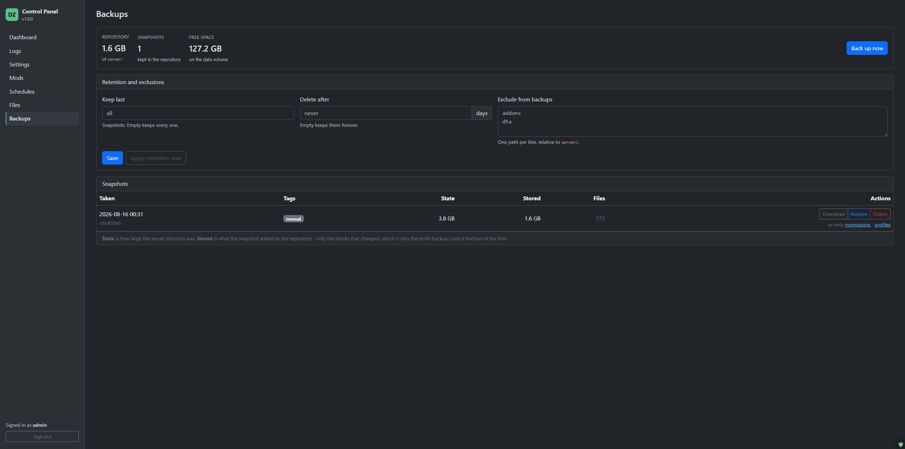

# DayZ Server + Control Panel

**A DayZ dedicated server in one container, with a web panel that runs it.**
Install the server files, manage mods, edit the config, schedule restarts,
browse files and take deduplicated backups — all from the browser. No shell,
no SteamCMD prompts, no config files edited over SSH.

Created by Jan Hüls "finex7070" 🚀

**→ [Get it running in four steps](#installation)** &nbsp;·&nbsp;
[Configuration](#configuration)

---

## What it is

One image, `ghcr.io/finex7070/dayz-docker-cp`, containing SteamCMD, the DayZ
Linux server and a Flask control panel. The **panel boots first** and owns
everything else: it downloads the server files, writes the config, starts and
supervises the server process, and stays up when the server is down — which is
exactly when you need it.

Everything that survives a container recreate lives in one volume, `/data`.
Delete the container, keep the volume, and your server is unchanged.

---

## Features

- **🎮 Server control** — Start, restart and stop from the dashboard, with live
  status: state, uptime, player count (Steam A2S), CPU and memory against the
  container's actual limits. *Running* means the mission is loaded and players
  can join — the engine says so itself, and until it does the state is
  *Starting*. A stop waits as long as you allow for the server to write its
  persistence, and the same button offers *Kill* while it waits. A crashed
  server is restarted automatically if you let it.
- **📦 SteamCMD without a terminal** — Install and update the server files from
  the browser, with live output and a **Steam Guard prompt** in the UI. The
  panel remembers when the files were last updated and last checked.
- **🧩 Mod management** — Install workshop mods by ID, URL or search, set each
  one as a client mod (`-mod`) or server-only mod (`-serverMod`), drag the load
  order into place, update, reinstall or remove. Signature keys follow the mod: a
  `.bikey` is in `server/keys` while the mod is enabled and a client mod, and
  *Sync keys* rebuilds the directory when it drifted. A mod uploaded into
  `server/` by hand joins the same list. A DayZ Launcher `modlist.html` can be
  imported, and exported again for your players.
- **⚙️ Settings, not text editors** — Launch parameters and the important
  `serverDZ.cfg` values as real forms with validation. Five values are written
  for you before every start, so they can never drift: `steamQueryPort`, the
  mission in `class Missions`, `RConPort`/`RConPassword` and `maxcores` in
  `dayzsetting.xml`.
- **🖥️ Live console and RCON** — The server's output streams into the dashboard
  as it happens. BattlEye RCON is built in: send commands, lock and unlock the
  server. The panel connects for the command and hangs up again, so there is no
  session to keep alive or lose.
- **⏰ Schedules** — Recurring tasks in crontab format, each with a *chain* of
  actions. The one everybody wants: announce → lock → stop → back up → start,
  as a single entry that cannot fall out of sync with itself. Each action can
  wait a number of seconds before it runs and say whether a failure should stop
  the rest, so a restart with warnings at −5, −1 and 0 minutes is one entry. An
  entry can also sit out the runs where the server is stopped.
- **📁 File browser** — Browse `server/`, edit text files in the browser
  (`Ctrl+S` saves), upload, download, rename, move and delete — with bulk
  actions. Pack any selection into a zip to download or keep, and unpack one
  in place. Binary files are recognised and offered for download instead of
  being destroyed by a text editor.
- **💾 Deduplicated backups** — Snapshots of the whole server directory powered
  by [restic](https://restic.net/). The first costs the full size, every later
  one only what changed: **3.8 GB read, 4.8 KB stored** for a second snapshot
  taken minutes later. Restore, download as `.tar`, delete, and retention rules
  (keep last N / delete after X days).
- **📜 Logs and audit trail** — `*.RPT`, `*.ADM` and script logs by type and
  file, with filtering, auto-reload and download. A second tab records what was
  done *in the panel*: who restarted the server, who changed which setting.
- **🔒 Sensible defaults** — Login with rate limiting, CSRF protection,
  reverse-proxy aware cookies, an upload cap, and a file browser that cannot be
  talked out of its root directory — not even with a symlink.

---

## Screenshots

### Dashboard

Server files with the build and check dates, live status tiles, the controls,
and the server's own output streaming in — with an RCON prompt underneath it.



### Mods

Three ways in, side by side: a workshop ID or URL, a zipped mod folder, or a
DayZ Launcher preset. Each mod is a client mod or a server-only mod, and the
order in this list is the order on the command line — drag a row by its handle
to change it. A mod that was not downloaded but uploaded — a `@Name` folder with
an `addons` directory in it — appears in the same list, marked *local* and
disabled until you say otherwise.
A preset imports as client mods; the export writes the enabled workshop mods,
client and server, into a file players can drop into their launcher — an
uploaded mod has no workshop page to point at, so it stays out.



### Settings

Launch parameters as a form. The CPU count writes `-cpuCount` *and* `maxcores`
in `dayzsetting.xml`; the mission is written into `class Missions` on every
start.



The `serverDZ.cfg` values worth changing, with the documented ranges enforced.
Everything not on this form — comments, hand-added options — stays untouched in
the file.



### Schedules

Crontab expressions, each with a chain of actions that runs top to bottom.
Actions are reordered with the arrow buttons, copied with *Copy*, can wait a
number of seconds before they run, and can be told to let the chain carry on
when they fail. *Run while the server is stopped* is on by default; off skips
the run and says so in the list, which is what a restart chain wants while the
server is down for maintenance. *Duplicate* copies a whole entry — the copy
comes out disabled, ready to be moved to another time.



### Files

The server directory in the browser: edit text files, upload, download, rename,
move, delete, with bulk actions and a `..` row instead of an up button. A
deleted folder goes with everything in it, and nothing here keeps copies — the
Backups page is what a file comes back from. *Zip selected* packs files and
folders into an archive, and a `.zip` unpacks in place.



### Backups

Snapshots with what each one *stored* rather than only what it contains,
retention rules, and restore or download per snapshot.



---

## Requirements

- **Docker** with Compose v2 (Docker Desktop, or Docker Engine on Linux)
- **A Steam account that owns DayZ.** App 223350 cannot be downloaded
  anonymously. Steam Guard is supported.
- **~10 GB of disk** for the server files, plus room for mods and backups
- **Open ports.** DayZ wants five UDP ports, and the panel one TCP port:

  | Port | Role | Variable |
  |---|---|---|
  | `2302` | Game — players connect here | `SERVER_PORT` |
  | `2303` | Reserved — the engine keeps it free | `SERVER_PORT` |
  | `2304` | BattlEye | `SERVER_PORT` |
  | `2305` | RCON | `RCON_PORT` |
  | `27016` | Steam query — what the server browser asks | `STEAM_QUERY_PORT` |
  | `8080/tcp` | The panel | `PANEL_PORT` |

  `SERVER_PORT` is published exactly as written, so it is one port or a range of
  up to three — pick how much you want reachable:

  | Value | Published | Use |
  |---|---|---|
  | `2302` | game only | No BattlEye. It runs, but the anti-cheat cannot talk to players. |
  | `2302-2304` | game, reserved, BattlEye | **What DayZ expects.** The default. |

---

## Installation

1. **Create a folder and fetch the two files you need:**

   ```bash
   mkdir dayz && cd dayz
   curl -O https://raw.githubusercontent.com/finex7070/dayz-docker-cp/main/docker-compose.yml
   curl -O https://raw.githubusercontent.com/finex7070/dayz-docker-cp/main/.env.example
   mv .env.example .env
   ```

2. **Fill in `.env`.** The bare minimum:

   ```ini
   ADMIN_PASSWORD=pick-something-long
   STEAM_USERNAME=your_steam_login
   STEAM_PASSWORD=your_steam_password
   ```

   The container refuses to start without `ADMIN_PASSWORD`. Comments in `.env`
   belong on their own line — Docker Compose only strips a trailing `#` comment
   from a value that is not empty.

3. **Pull the image and start it:**

   ```bash
   docker compose pull
   docker compose up -d
   ```

   Pull first: the compose file also carries a `build:` section for people
   working on the source, and without an image present Compose would try to
   build one — in a folder that has no Dockerfile.

4. **Open** `http://<host>:8080` and log in with `ADMIN_USERNAME` /
   `ADMIN_PASSWORD`.

To update later: `docker compose pull && docker compose up -d`. Your `/data`
volume is untouched.

<details>
<summary>Building from source instead of pulling</summary>

```bash
git clone https://github.com/finex7070/dayz-docker-cp.git
cd dayz-docker-cp
cp .env.example .env      # then edit it
docker compose build
docker compose up -d
```

The compose file names the published image, so a local build simply replaces
it under the same tag.
</details>

---

## Getting started

1. **Install the server files.** The dashboard opens on the *Server files*
   card. With `AUTO_INSTALL=true` (the default) the download already started;
   otherwise press *Install server files*. It is several GB, so it takes a
   while, and the output runs live.
2. **Answer Steam Guard** if asked. The code field appears on the dashboard —
   the code goes straight to the running SteamCMD process and is never stored.
   Only the first login needs it: SteamCMD keeps a session afterwards and the
   panel logs in with that, so later runs go through untouched. On **Steam Guard
   Mobile** the first login has to be approved from the phone as well.
3. **Set an RCON password** under *Settings → General → BattlEye*. Without one
   RCON stays off, and with it you get the console, lock/unlock and everything
   the scheduler can do. Note that BattlEye only opens its port about two
   minutes after a start, once the mission has loaded.
4. **Add your mods** on the *Mods* page, by workshop ID or URL — or import a
   `modlist.html` from the DayZ Launcher. Set client versus server mods, then
   put the load order right with the arrows.
5. **Check the launch parameters** under *Settings → General* — mission, CPU
   count, FPS limit, logging switches.
6. **Press Start** on the dashboard and watch the console.

---

## Configuration

Everything that has to match how the container was created lives in `.env`.
Everything else — mission, mods, launch switches, RCON password, schedules,
retention — is edited in the panel and stored in the volume.

| Variable | Default | What it does |
|---|---|---|
| `ADMIN_USERNAME` / `ADMIN_PASSWORD` | `admin` / — | Panel login. The password is **required**. |
| `PANEL_PORT` | `8080` | Port of the web panel. |
| `STEAM_USERNAME` / `STEAM_PASSWORD` | — | Steam account owning DayZ. |
| `STEAM_GUARD_CODE` | — | Only for the very first login; otherwise enter it in the panel. |
| `STEAM_API_KEY` | — | Optional, only for workshop *search*. Installing by ID works without it. |
| `SERVER_REAL_IP` | — | Public address, shown on the dashboard with a copy button. Display only. |
| `SERVER_PORT` | `2302-2304` | One port or a range of up to three. The first is the game port. |
| `STEAM_QUERY_PORT` | `27016` | Written into `serverDZ.cfg` before every start. |
| `RCON_PORT` | `2305` | Written into `beserver_x64.cfg` before every start. |
| `AUTO_INSTALL` | `true` | Install the server files on container start if missing. |
| `AUTO_START` | `false` | Start the server once the files are there. |
| `MAX_UPLOAD_MB` | `64` | Upload limit of the Files page (and of every request). |
| `TRUSTED_PROXY_IPS` | — | Proxies whose `X-Forwarded-*` headers are honoured. Empty = ignored. |
| `SESSION_COOKIE_SECURE` | `auto` | `auto` sets the Secure flag on HTTPS requests only. |
| `PUID` / `PGID` | `1000` | Owner of the bind mount on Linux hosts (`id -u`, `id -g`). |
| `TZ` | `Europe/Berlin` | Container timezone — schedules and log timestamps follow it. |

The full list with comments is in [.env.example](.env.example).

### The `/data` volume

```
data/
├── panel/     panel settings, mod list, schedules, audit log
├── steam/     Steam home: sentry file, SteamCMD runtime, workshop downloads
├── server/    the DayZ server: binaries, mpmissions/, keys/, @mods, profiles/
└── backup/    the restic repository, its key
```

### Behind a reverse proxy

Set `TRUSTED_PROXY_IPS` to your proxy's address or network (e.g.
`172.16.0.0/12`), otherwise the panel sees the proxy as the client — which
breaks the login rate limit and HTTPS detection. TLS itself belongs on the
proxy; the panel deliberately does not terminate it.

---

## Backups

> ### Keep a copy of the key
>
> Backups are **encrypted**, and the key lives beside them in
> `data/backup/backup_key`. It is created with your first backup and never
> changes.
>
> **Without that file the repository cannot be read**, not even by this panel.
> Keep a copy of it somewhere else — it is 65 bytes, and it is the difference
> between having backups and having 2 GB of noise.
>
> Because the key sits next to the repository, copying `data/backup` elsewhere
> copies the key with it. If you push backups to a NAS or cloud storage where
> that matters, leave `backup_key` out of that copy and store it separately.
>
> If it goes missing while the repository exists, the panel deliberately does
> **not** create a new one — a new key would turn "the file is gone" into
> "wrong password", which is far harder to work out.

**Retention:** *keep last N* and *delete after X days* may both be set. A
snapshot survives if **either** rule keeps it — an or, not an and. An age rule
alone can never empty the repository: the newest snapshot always stays.

**Restoring** stops the server, takes a `pre-restore` snapshot of the current
state, puts the directory back and starts the server again. Files that do not
exist in the snapshot are **deleted** — otherwise it would be a copy over the
top, and a botched mod update would survive its own restore.

**A snapshot taken while the server runs** is tagged `hot`: persistence is
being written during it, so it is not a consistent point in time. That is what
the `stop → backup → start` chain in the scheduler is for.

By default the whole server directory is backed up, so a restored snapshot is a
server that starts without SteamCMD. If you would rather keep the repository
small, exclude `addons` and `dta` on the Backups page — Steam can always
re-download those.

---

## Release notes

**1.2.4** — One Steam login, not one per job. The panel put the password on
every SteamCMD command line, which forces a full credential login: SteamCMD
names the difference itself, `Logging in using username/password.` against
`Logging in using cached credentials.`. With email Steam Guard that is only
wasteful; with **Steam Guard Mobile** every credential login has to be approved
from the phone, so a server with updates on start asked for approval on every
restart. `+login` now carries the username alone and reuses the session
SteamCMD stores, and the password is typed in only when there is no session to
reuse — the first run, or an expired token. Verified against a Guard Mobile
account: the first job asks for approval once, every job after it logs in
untouched. While the phone is being waited on the panel now says so, in the log
and next to the job, instead of looking like a job that stopped; and a login
nobody approves in time now reports that rather than `exit code 5`. As a side
effect the password no longer appears in the container's process list.
A job card on the dashboard also folds itself away five seconds after the
job succeeds, instead of leaving the SteamCMD log open above the server
controls. A failed one stays, since that log is the reason to read it.
Finally, a stop no longer waits out its whole timeout on a server that has
already finished: DayZ sometimes dies in its own teardown after `~DayZGame()`
and never exits, and the panel now gives that ten seconds rather than sixty,
and says the save was written before it kills the process.
`STEAM_PASSWORD` is also optional now: it is read only when there is no
session to reuse, so once the first login has gone through you can empty it
again and keep it off the disk.

**1.2.3** — Changing `SERVER_PORT` works. The published game ports were written
into `docker-compose.yml` by hand as `2302-2304`, so moving the port started the
server where nothing was forwarded — while the dashboard went on showing the
port it was not reachable on. `SERVER_PORT` now carries what is published, as
one port or a range of up to three: game, reserved and BattlEye.
`SERVER_PORT=2402-2404` moves all three. **Check your `.env`**: a bare
`SERVER_PORT=2302` stays valid and now means *game port only*, so BattlEye is no
longer forwarded — write `SERVER_PORT=2302-2304` to keep what you had. The Steam master
port `8766` is no longer published — nothing has bound it since Steamworks
dropped that port in SDK 1.51, and the query port is what lists a server.

**1.2.2** — *Running* now means the mission is loaded. The panel used to say so
the moment the process existed, which on a measured 1.29 start was more than two
minutes early: the console command line and the RCON buttons were offered while
BattlEye was not yet answering. The engine announces the moment itself
(`Player connect enabled`), and the watcher that already reads every line it
prints now waits for it — the state in between is *Starting*. How long a stop
waits for the server to save before the process is killed is a setting
(*Behaviour*, 5 to 600 seconds, 30 by default); a full server writes its
persistence for longer than an empty one. While it waits, the Stop button
becomes **Kill**, which ends the process at once and says what that costs.

**1.2.1** — The load order is dragged into place by the handle at the left of
each row, instead of one click per step: a freshly installed mod sits at the
bottom, and putting it first used to be a click per row. Dropping it saves the
whole order at once; the arrow keys do the same when the handle has focus.

**1.2.0** — Uploaded mods are managed like any other. A folder in `server/`
that starts with `@` and has an `addons` directory in it is a mod, so it joins
the list with a type, a place in the load order and its keys — disabled, so a
folder appearing on disk never puts itself on the next command line. Update and
Reinstall are not offered for one: there is nothing to fetch it from, and the
mod list export leaves it out for the same reason.

The top of the page is three cards now — install from the workshop,
upload a zipped mod, or import and export a launcher preset. The upload takes the
`@Name` folder as it is, lowercases the names for Linux and puts the mod
straight into the list; a second upload of the same folder replaces it.

Signature keys now follow the mod exactly: a `.bikey` sits in `server/keys`
while the mod that ships it is enabled and a client mod, and not otherwise.
That is checked after a download, on a type switch and when a mod is switched
on or off — the case that used to be missed, and the one where a missing key
turns into every player being rejected. *Sync keys* over the list rebuilds the
directory from scratch for the cases the panel cannot see coming: it empties
`server/keys` and copies back what the enabled mods bring. The DayZ key is left
where it is.

**1.1.3** — RCON no longer holds a session open. The panel logs in for the
command, reads the answer and hangs up, which ends the `RCON disconnected: no
answer to the keepalive` line that a loading server produced every time. *Lock*,
*Unlock* and the command line now follow the server: they are active while it
runs and a password is set, and a failed attempt says why instead of the button
being greyed out for reasons of its own. That message also stays on screen —
the status poll right behind the click used to wipe it.

A schedule can now sit out the runs where the server is stopped: *Run while the
server is stopped*, on by default. Off, the entry is stamped as *skipped*
rather than starting a server that was deliberately down.

**1.1.2** — Updating mods no longer runs SteamCMD once per mod. The panel asks
Steam in a single request what has changed since each mod was installed, skips
the ones that have not, and downloads the rest in one SteamCMD run with one
login — which is what "Steam is rate limiting this account" was about, and most
of the waiting. With nothing to update it finishes in under a second without
starting SteamCMD at all.

The Upload button counts the upload up and says when the panel is writing it,
instead of a large upload looking like a dead button for minutes. An answer
that is not JSON — a reverse proxy refusing the body, for one — is reported
instead of reloading the page over it. Row menus in the file browser and on the
Backups page are no longer clipped by the table they sit in, and a snapshot's
download menu now also offers `serverDZ.cfg`, `ban.txt` and `whitelist.txt`,
each handed over as the file itself rather than wrapped in a tar.

**1.1.1** — An installed mod's ID links to its workshop page, in a new tab.
Deleting a folder in the file browser takes what is in it, instead
of refusing until the folder was emptied by hand. The file browser no longer
keeps copies of its own in `data/backup` on a delete, an overwriting upload or
an extract: that directory belongs to the Backups page and its restic
repository, which is also what a deleted file comes back from. An install that
ran an earlier version has a `data/backup/files/` directory left over — nothing
writes to it any more, and it can be removed once you no longer want what is
in it.

**1.1.0** — Files can be packed into a zip and unpacked again on the Files page.
A DayZ Launcher `modlist.html` can be imported on the Mods page and
exported again for players. Schedule actions can be reordered with arrow
buttons, copied, wait a set number of seconds before they run, and carry on
past their own failure — a restart with warnings at −5, −1 and 0 minutes is one
entry instead of four. A whole schedule can be duplicated, disabled, from the
list. Fixes a scheduled run recording nothing at all: writing the audit entry
threw in the scheduler's own thread, after the actions had already run.

**1.0.1** — *Apply retention now* no longer fails on a fresh install, where
there is no repository yet; paths from the container no longer appear in
messages that come from restic.

**1.0.0** — First public release. Server control, SteamCMD, mods, settings,
logs, live console with RCON, schedules, file browser and deduplicated backups.

---

## License

GNU Affero General Public License v3.0 (AGPLv3)

This project is open-source and available under the AGPLv3 license.

✅ Commercial Use: You are free to run this on commercial game servers, including monetised ones.
✅ Modification: You are free to modify the code to suit your needs.
🔄 Copyleft: If you distribute a modified version — or make one available to others — you must release your modifications under the same AGPLv3 license. Closed-source proprietary forks are not allowed.

See the [LICENSE](LICENSE) file for full details.

> "DayZ" is a product of Bohemia Interactive a.s.; "Steam" and "SteamCMD" are
> products of Valve Corporation. This project automates their tools but is not
> affiliated with, sponsored by or endorsed by either company.
>
> No game files are distributed here. The image ships SteamCMD and downloads
> the DayZ server files from Steam with **your own account**, under Bohemia
> Interactive's and Valve's terms — which is why the container needs a Steam
> login that owns DayZ.

---

> Made with ❤️ by Jan Hüls "finex7070"